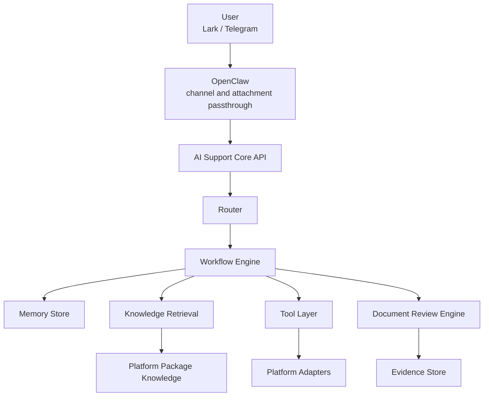

# OpenClaw AI Support Core

An installable AI customer-support service for OpenClaw.

## OpenClaw Start Here

OpenClaw should sync this repository from `main`.

- Repository: `https://github.com/lichang2137/Ai-server`
- Branch: `main`
- Runtime entry: `app.main:app`
- OpenClaw ingress: `POST /v1/support/message`

Expected deployment mode:

1. OpenClaw syncs `main` to the Tencent Cloud host.
2. The host writes a local `.env.local` with runtime and Feishu values.
3. OpenClaw starts the FastAPI service from this repo.
4. OpenClaw exposes a child agent that forwards user messages and attachments into this service.

If OpenClaw is pulling `main`, it is pulling the current supported service version. Do not point OpenClaw at old prototype branches.

If the live status Bitable must be managed by multiple human operators, create it in a shared Feishu folder and bootstrap it with `python scripts/create_okx_feishu_bitable.py --folder-token <shared_folder_token>`. That avoids app-owned permission dead ends later.

OpenClaw is responsible for channel access, message delivery, session passthrough, and attachment passthrough.
This service is responsible for routing, workflows, knowledge retrieval, live status tools, KYB document review, handoff summaries, and runtime persistence.

## What V1 ships

- `knowledge_qa`
  Answer rules, SOPs, FAQs, and announcements from the active platform package.
- `status_diagnosis`
  Use live adapters first. If no adapter is available, return documentation-backed guidance instead of pretending to know live status.
- `kyb_review`
  Accept PDF, image, and Office uploads. Extract fields, cross-check documents, calculate freshness, and produce a human-review recommendation with evidence.
- `handoff`
  Generate a structured summary for human support or review teams.

## Architecture



Detailed notes live in [docs/AI_SERVER_V1_ARCHITECTURE.md](/C:/Users/26265/Documents/New%20project/Ai-server/docs/AI_SERVER_V1_ARCHITECTURE.md).

## Quick start

```bash
python -m pip install -r requirements.txt
uvicorn app.main:app --reload
```

Health endpoint:

- `GET /health`

OpenClaw ingress endpoint:

- `POST /v1/support/message`

The service will auto-load `.env.local` from the repo root if present.

## Request example

```json
{
  "channel": "telegram",
  "channel_user_id": "tg-user-1",
  "session_id": "sess-1",
  "platform_user_id": "uid_10002",
  "message_id": "msg-001",
  "text": "Why is my KYB still pending?",
  "timestamp": "2026-03-28T10:00:00Z",
  "context": {
    "locale": "zh-CN",
    "attachments": []
  }
}
```

## Platform packages

Each installable platform lives under `platforms/<platform_id>/` and must include:

- `platform.yaml`
- `knowledge/`
- `rules/`
- `schemas/`
- `prompts/`
- `examples/`
- optional `adapters/`

The runtime validates this layout at startup.

The current default platform is `okx_help`.

## OpenClaw installation

See [docs/OPENCLAW_INSTALL.md](/C:/Users/26265/Documents/New%20project/Ai-server/docs/OPENCLAW_INSTALL.md).

For the temporary live-status plan backed by Feishu Bitable, see [docs/OKX_FEISHU_BITABLE_SETUP.md](/C:/Users/26265/Documents/New%20project/Ai-server/docs/OKX_FEISHU_BITABLE_SETUP.md).

## Runtime schema

The storage schema is documented in [sql/ai_support_runtime_schema.sql](/C:/Users/26265/Documents/New%20project/Ai-server/sql/ai_support_runtime_schema.sql).

## Tests

```bash
pytest
```
