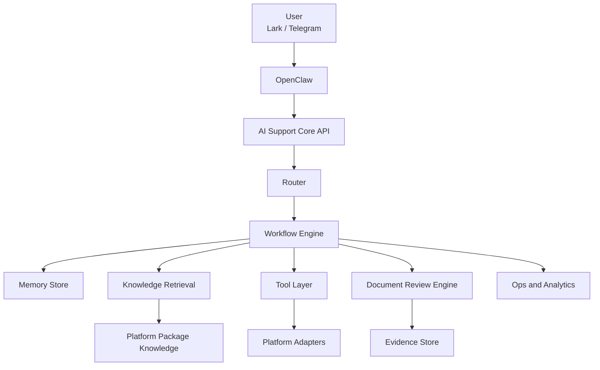

# OpenClaw AI Support Core v1.0

## Product shape

This project is an installable AI customer-support service for OpenClaw.

- OpenClaw handles channel integration, message passthrough, identity passthrough, and attachment passthrough.
- The AI service handles routing, workflow execution, knowledge retrieval, state diagnosis, KYB document review, evidence capture, and human handoff summaries.
- Platform switching is done through a platform package plus an optional adapter.

## Core routes

- `knowledge_qa`
  Rules, SOPs, onboarding materials, policy explanations, and announcements.
- `status_diagnosis`
  KYB, wallet, deposit, withdraw, and ticket-style status diagnosis.
- `kyb_review`
  PDF, image, and Office document review with extraction, cross-checking, freshness checks, and evidence-backed recommendations.
- `handoff`
  Human escalation for security, repeated clarification loops, or review-required cases.

## System architecture



## OpenClaw ingress contract

`POST /v1/support/message`

```json
{
  "channel": "lark|telegram",
  "channel_user_id": "string",
  "session_id": "string",
  "platform_user_id": "string|null",
  "message_id": "string",
  "text": "string",
  "timestamp": "ISO-8601",
  "context": {
    "locale": "zh-CN",
    "attachments": [
      {
        "attachment_id": "string",
        "name": "string",
        "mime_type": "string",
        "url": "string",
        "size_bytes": 12345
      }
    ]
  }
}
```

Response:

```json
{
  "route": "knowledge_qa|status_diagnosis|kyb_review|handoff",
  "reply": {
    "text": "string",
    "structured": {
      "conclusion": "string",
      "evidence": ["string"],
      "next_action": ["string"]
    }
  },
  "review": {
    "needed": false,
    "summary": null
  },
  "handoff": {
    "needed": false,
    "summary": null
  }
}
```

## Platform package contract

Each platform package must provide:

- `platform.yaml`
  Basic metadata and enabled workflows.
- `knowledge/`
  FAQ, SOP, rule, and announcement content.
- `rules/`
  Diagnostic and document-review rules.
- `schemas/`
  Output and mapping schemas.
- `prompts/`
  Rendering templates and platform-specific prompts.
- `examples/`
  Example requests, document cases, or validation fixtures.
- optional `adapters/`
  Live status adapters or internal integration code.

The runtime validates this layout during startup.

## Document review engine

The review engine follows a deterministic sequence:

1. Detect input type and load file bytes.
2. Extract text from PDF, Office, or image sources.
3. Classify document type from filename and text evidence.
4. Extract structured fields with rule-driven regexes.
5. Normalize names and identifiers for cross-document checks.
6. Run required-document checks.
7. Run cross-document consistency checks.
8. Run freshness checks.
9. Emit a human-review recommendation.
10. Persist evidence references for audit.

Current document classes:

- `CI`
- `COI`
- `M&A`
- `CTC`
- `Passport`
- `PoBA`
- `OnboardingForm`
- `Unknown`

## Runtime persistence

The service stores:

- support sessions
- inbound and outbound message events
- handoff summaries
- review cases

See [sql/ai_support_runtime_schema.sql](/C:/Users/26265/Documents/New%20project/Ai-server/sql/ai_support_runtime_schema.sql).
